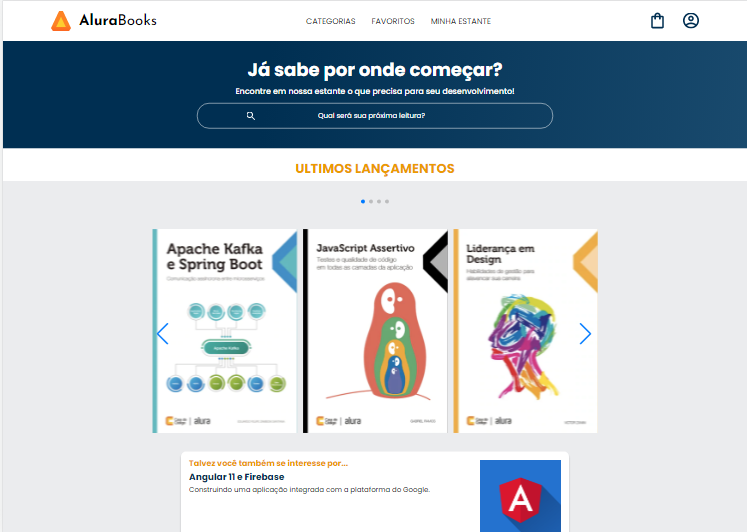

<h1 align="center"></h1>

# Índice 

* [Descrição do Projeto](#descrição-do-projeto)
* [Acesso ao Projeto](#acesso-ao-projeto)
* [Tecnologias utilizadas](#tecnologias-utilizadas)
* [Pessoas Desenvolvedoras do Projeto](#pessoas-desenvolvedoras)

# Descrição do projeto 
    
     AluraBooks é projeto de um e-commerce de livros idealizado no curso de HTML e CSS: responsividade com  mobile-first a ptaforma Alura. O projeto foi desenvolvido seguindo as aulas do mesmo e também ao modelo   proposto no Figma pelos designs  página.

    As aulas abordavam os conhecimentos básicos e avançados de HTML e CSS e a implementação da   biblioteaca do Swipper, enquanto a página era desenvolvida utilizando do metódo de Mobile-first. 

    E esse é o meu resultado final.

# Acesso ao projeto 

[Deploy do projeto](https://alura-books-chi-three.vercel.app/)

# Tecnologias utilizadas

 * HTML5
 * CSS3
 * Mobile-first
 * Figma
 * Biblioteca Swipper

# Pessoas desenvolvedoras 

 * Minhas redes 

 [LinkedIn](https://www.linkedin.com/in/marioanthony/) 

 [Twitter](https://twitter.com/AnthonycomY) 
 
 [Instagram](https://www.instagram.com/mario_apr/) 

 * Página do curso 
 
 [HTML e CSS: responsividade com mobile-first](https://cursos.alura.com.br/course/html-css-responsividade-mobile-first)
